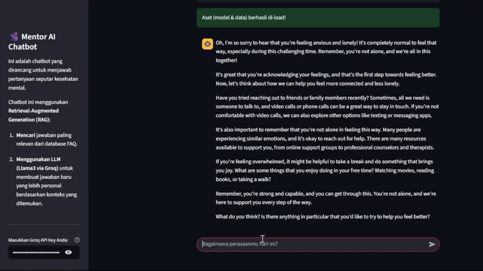

# 🤖 Mentor AI - RAG Chatbot untuk Kesehatan Mental


-green.svg)

**Tonton Demo Aplikasi di Bawah Ini!**



---

## 📄 Project Overview

Proyek ini adalah implementasi sebuah **sistem chatbot cerdas end-to-end** yang dirancang untuk menjawab pertanyaan seputar kesehatan mental. Aplikasi ini dibangun di atas arsitektur **Retrieval-Augmented Generation (RAG)**, yang menggabungkan kekuatan *semantic search* untuk menemukan informasi relevan dengan kemampuan generasi teks dari *Large Language Model (LLM)* canggih.

Hasilnya adalah sebuah chatbot yang tidak hanya memberikan jawaban akurat berdasarkan database FAQ, tapi juga menyampaikannya dengan gaya bahasa yang natural, empatik, dan personal. Seluruh aplikasi ini dibungkus dalam sebuah *interface* web interaktif yang dibangun menggunakan **Streamlit**.

---

## ✨ Features

* **Semantic Search**: Menggunakan model `sentence-transformers` untuk menemukan jawaban yang paling relevan secara makna, bukan hanya kata kunci.
* **LLM-Powered Generation**: Memanfaatkan kecepatan **Groq API** dengan model **Llama3-8B** untuk mensintesis jawaban baru yang lebih manusiawi berdasarkan konteks yang ditemukan.
* **Retrieval-Augmented Generation (RAG)**: Arsitektur modern yang memastikan jawaban tetap faktual (berdasarkan database) namun disampaikan secara conversational.
* **Interactive Web UI**: Dibangun dengan **Streamlit** untuk pengalaman pengguna yang ramah dan intuitif.

---

## 🏛️ Arsitektur & Teknologi

Proyek ini menggunakan alur kerja RAG yang modern:

**User Question** ➔ **1. Embedding Model** (SentenceTransformer) ➔ **2. Semantic Search** (vs Database FAQ) ➔ **3. Retrieved Context** ➔ **4. Prompt Template** ➔ **5. LLM (Groq/Llama3)** ➔ **Final Answer**

* **Tech Stack**:
  * **UI**: Streamlit
  * **Orchestration**: LangChain
  * **LLM API**: Groq
  * **Embedding & Search**: Sentence-Transformers, PyTorch
  * **Data Handling**: Pandas

---

## 🚀 How to Run Locally

1.  **Clone the repository:**
    ```bash
    git clone [https://github.com/rizanss/FAQ-Chatbot-LLM.git](https://github.com/rizanss/FAQ-Chatbot-LLM.git)
    cd FAQ-Chatbot-LLM
    ```

2.  **Create and activate a virtual environment:**
    ```bash
    python -m venv .venv
    .\.venv\Scripts\activate 
    ```

3.  **Install dependencies:**
    ```bash
    pip install -r requirements.txt
    ```

4.  **Set up API Key:**
    * Buat folder `.streamlit` di dalam direktori proyek.
    * Di dalam `.streamlit`, buat file `secrets.toml`.
    * Isi file tersebut dengan API key Groq Anda:
      ```toml
      GROQ_API_KEY = "gsk_..."
      ```

5.  **Run the application!**
    ```bash
    streamlit run app.py
    ```
    Buka browser dan akses alamat `http://localhost:8501`.

---

## 📬 Contact
* **Author:** Riza Nursyah
* **GitHub:** [rizanss](https://github.com/rizanss)
* **LinkedIn:** [Riza Nursyah](https://www.linkedin.com/in/riza-nursyah-31a6a7221/)
